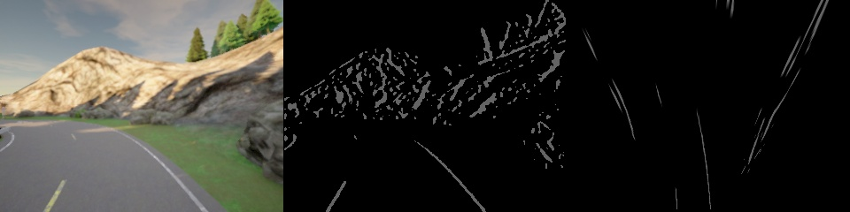
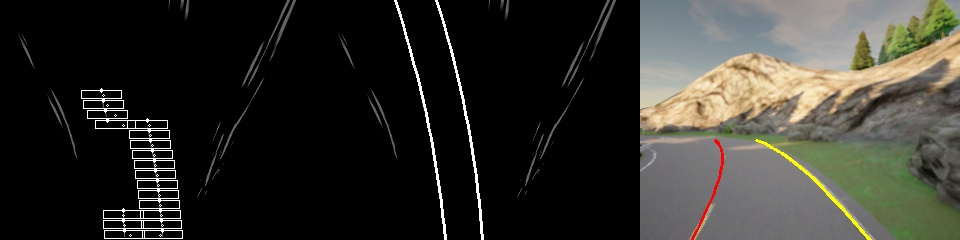
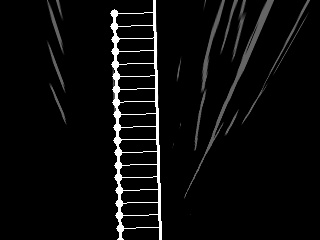
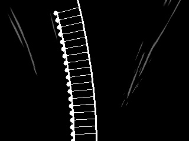
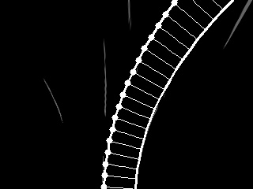
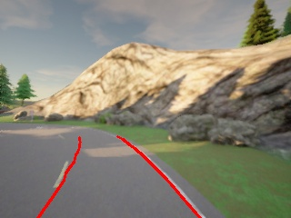

# Lane Lines detection

## About

The main goal of this implementation is the detect the lane boundaries, from images captured from a front-facing camera. For this case, the images are captured with CARLA [1] The processing pipeline takes an image, filters it (using a Sobel filter [2]). This highlights the areas with high gradient changes.

The perspective of the filtered image is changed (bird's eye view) to make easier lane detection. Then a window is applied to create a histogram of detections. The peek is taken as the highest probability for the lane. Based on the peak position, the detector-window position is adjusted to follow the detections (i.e. curve position).

After all the points were detected, a polynomial fit is applied, and a curve is interpolated. What is remaining is to un-warp the image and visualize the points.

<p align="center"> 

<div align="center">Left: input image,Middle: Filtered image, Right: Warped image</div>
</p>
<p align="center">

<div align="center">Left: slideing window with detection peaks,Middle: interpolated lines, Right: back-projected lines</div>
</p>

The implementation can be tweaked to different scenarios, for outliers RANSAC can be used, or in case of a missing middle line, an equidistant approximated line can be generated [3].

<p align="center"> 




<div align="center">Reprojection of the right line, to estimate the missing middle line</div>
</p>

## How to use it
```
Set the image projection parameters (original image size 320x240 RGB):
src=[[50, 240], [200, 240], [0, 0], [320, 0]]
dst=[[135, 270], [150, 270], [0, 0], [320, 0]]

Set the detector parameters:
scan_range={'start':0,'stop':240,'steps':10}
scan_window={'height':8,'max_adjust':8}

Simply call the python file, the detections will be displayed. 
python test_detections.py
```

##### To Do
- make more robust detections - with better filtering - to reduce the false positives
- optimize the peak detector to detect the middle points of the histogram, not the first global maxima


## Resources

1. [CARLA simulator](https://carla.org/)
2. [Sobel OpenCV](https://docs.opencv.org/3.4/d2/d2c/tutorial_sobel_derivatives.html)
3. [Tangents and Normals](https://www.intmath.com/applications-differentiation/1-tangent-normal.php)
4. [Robust linear model estimation using RANSAC](https://scikit-learn.org/stable/auto_examples/linear_model/plot_ransac.html)

/Enjoy